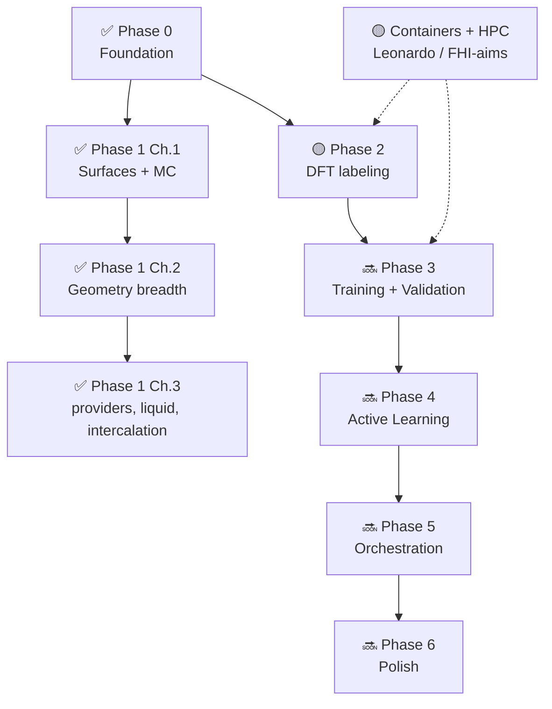

# Roadmap

TrainCraft is developed in phased, independently-testable chunks. The dataset +
selection layer is the spine — everything else builds on it.

---

## ✅ Phase 0 — Foundation

**Done.** A clean, installable, testable package with no globals.

- pydantic v2 config models (discriminated unions, `extra=forbid`)
- `Structure` (with content hash), registry, `Workspace`/`Job`, provenance
- Geometry: file/scratch sources; nanotube/molecule builders; vacuum/supercell/perturb transforms
- Calculators: `emt`, `tblite`/`xtb`, `mace` (MP0 + fine-tuned)
- Sampling: `md` (Langevin NVT), `rattle` (HiPhive)
- Selection funnel: physicality → dedup → diversity (FPS)
- Dataset: extxyz IO with provenance; hash-dedup
- CLI: `run` / `validate` / `new` / `plugins`
- 6 annotated examples, 19 tests, CI on GitHub Actions

---

## ✅ Phase 1, Chunk 1 — Molecules on Surfaces + Monte Carlo

**Done.** Fragment identity + surface adsorbate builders + Metropolis MC.

- `core/fragments.py` — per-atom `tc_fragment` array; `infer_fragments` for reactive runs
- `smiles` source — RDKit ETKDG + MMFF
- `surface_adsorbate` builder — single adsorbate on crystalline slab
- `surface_packing` builder — N-molecule coverage via Packmol
- `monte_carlo` sampler — translate/rotate/conformer-swap with Metropolis acceptance
- Examples 07–11 (CO on Cu, ethanol, butane)

---

## ✅ Phase 1, Chunk 2 — Mechanical Geometry Breadth

**Done.** All common bulk, surface, and 2D structure types.

- `core/converter.py` — ASE ↔ pymatgen ↔ RDKit bridge
- `url` source — download → ASE read
- `crystal` builder — bulk + supercell + vacancy/substitution/interstitial defects
- `slab` builder — named facet *or* arbitrary Miller indices; all-framework
- `layered` builder — graphene/hBN/MX₂; AA/AB stacking; twist (non-periodic moiré flake)
- Transforms: `strain` (hydrostatic/Voigt), `rotate`, `set_pbc`
- Examples 12–14, 36 additional tests

---

## ✅ Phase 1, Chunk 3 — Database Providers, Liquids, Intercalation, Constraints

**Done.** Remaining geometry breadth (except the `polymer` builder).

- Sources: `materials_project` (mp-api), `optimade` and `pubchem` (both dependency-free)
- `liquid` builder — Packmol multi-species box (explicit cell *or* density-driven)
- `intercalation` builder — guests per gallery of a planar layered host, with staging
- `constraints` transform — `FixAtoms` on the final structure (fixes the legacy
  index-misalignment bug after reordering builders)
- Examples 15–17, unit tests (network/Packmol paths skip when deps are absent)
- *Deferred:* `polymer` (PySoftK) — dependency is unreliable; wrapper to be verified
  against the live API rather than guessed

---

## 🟡 Phase 2 — DFT Labeling

Label selected frames with energy, forces, stress, dipole, and polarizability.

- ✅ `calculators/dft.py` — FHI-aims (`fhi_aims`) and Quantum ESPRESSO (`qe`) factories;
  FHI-aims polarizability via DFPT (`dielectric` periodic / `polarizability` molecular,
  auto-selected). Run command **injected from the environment** so the plugins stay
  container-agnostic. QE polarizability raises `NotImplementedError` (needs a `ph.x` run).
- 🔜 Level-of-theory provenance in the extxyz output tree + `manifest.json`
- 🔜 Cost-aware labeling: polarizability flagged as the expensive task
- 🔜 Production runs on **Leonardo** via the `traincraft-dft` container (see below)

---

## 🟡 Cross-cutting — Packaging & HPC Deployment (Leonardo)

Run the real workflow on CINECA Leonardo via **Apptainer**. See
[`DESIGN.md` §20](https://github.com/your-org/traincraft/blob/main/DESIGN.md) and
the [`how-to/HPC on Leonardo`](how-to/hpc-leonardo.md) guide.

- ✅ Architecture + three Apptainer `*.def` files (`containers/`): `traincraft-core`
  (CPU orchestrator), `traincraft-mlip` (GPU/Booster MACE), `traincraft-dft`
  (CPU/DCGP FHI-aims — private, licensed)
- 🔜 `orchestration` executor config that renders `srun [--nv] apptainer exec` Slurm steps
- 🔜 Build + validate the three images on Leonardo (single-node FHI-aims, then multi-node)

---

## 🔜 Phase 3 — Training + Validation

Train a multi-head MACE model and measure quality end-to-end.

- MACE fine-tune/train wrapper (`mace_run_train --foundation_model`)
- Multi-head config: energy/forces + optional dipole + polarizability
- Dataset health tooling: composition/space/volume coverage, force distributions
- Validation: parity plots, RMSE/MAE per element, NVE stability, EOS/phonons
- **IR and Raman spectra** reconstructed from MLIP-driven MD vs DFT/experiment

---

## 🔜 Phase 4 — Active-Learning Loop

Close the loop: explore → select → label → retrain → converge.

- `selection/uncertainty.py` — committee/ensemble uncertainty selector
- `active_learning/` — full loop with resume/idempotency
- Convergence criteria: val force-RMSE + spectral error thresholds

---

## 🔜 Phase 5 — Orchestration

Parallel execution of the active-learning loop.

- Local engine hardened: threadpool for independent jobs
- QuACC adapter: explore + label stages as a parallel DAG
- Identical science, swappable engine

---

## 🔜 Phase 6 — Polish & Extras

- Full public API docs + library-usage tutorials (including Raman use case)
- Additional MLIP backends: MatterSim, Orb, SevenNet, CHGNet
- Node-based workflow editor emitting serialised TOML

---

## Dependency graph

