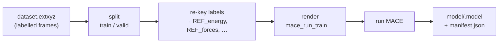
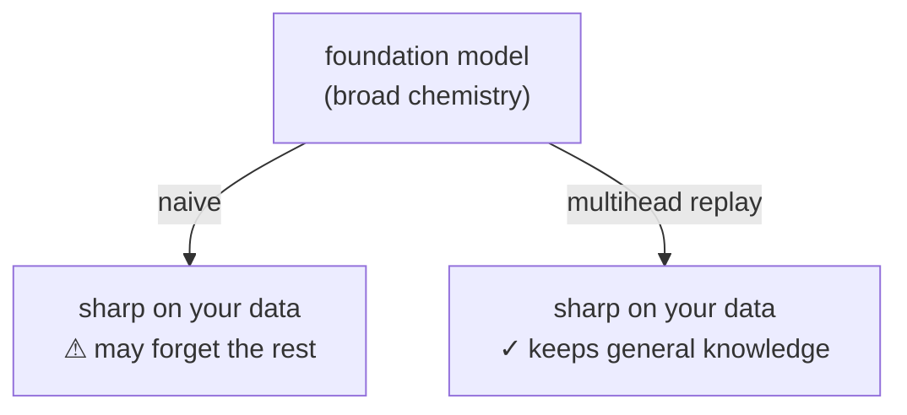

# Tutorial 10 · Training a MACE Model

**What you'll learn:** how to take the dataset the spine produced and *train a
MACE interatomic potential* on it — fine-tuning a foundation model, choosing the
property heads (including the dipole/polarizability heads that power IR & Raman),
reading the output, and plugging the trained model back into the loop.

**Prerequisites:** [Tutorial 1](01-first-dataset.md) (the spine) and
[Tutorial 7](07-mace-mp0.md) (MACE foundation models). Training itself needs
`pixi install -e mace` (torch + mace-torch) and is much faster on a GPU.

---

## Quickstart (the 60-second version)

If you already have a labelled dataset and just want to train, add a `[training]`
section and run:

```toml title="train.toml"
[geometry.builder]            # (the spine that fills the dataset)
type = "crystal"
name = "Cu"
crystalstructure = "fcc"
cubic = true
supercell = [2, 2, 2]

[calculator]
type = "emt"

[sampling]
type = "md"
temperature = 600.0
steps = 200

[selection]
budget = 10

[labeling.calculator]
type = "emt"                  # real runs: "fhi_aims" / "qe"

[dataset]
path = "dataset"

[training]                    # ← the new stage
type = "mace"
name = "cu_finetune"
foundation_model = "medium"   # fine-tune the medium MACE-MP foundation
heads = ["energy", "forces", "stress"]
pt_train_file = "mp"          # replay data (keeps the model from forgetting)
```

```bash
pixi run -e mace traincraft run train.toml
```

That's it — TrainCraft builds the data, then trains. The model lands in
`runs/<name>/model/cu_finetune.model`. The rest of this tutorial explains *what
each knob does and why the defaults are what they are.*

!!! tip "Try it with zero GPU/torch first"
    Want to see the pipeline wiring without installing torch? Run it as far as the
    dataset and inspect the **command TrainCraft would run** with a dry run — see
    [Inspect before you train](#inspect-before-you-train) below.

---

## The mental model

TrainCraft never reimplements training — it *drives* MACE's `mace_run_train`.
Think of the `[training]` stage as a careful, reproducible front-end:



`core` does the bookkeeping — splitting, re-keying labels, rendering the exact
command, recording a manifest — and MACE does the maths. Because `core` only
*builds a command and shells out*, the heavy torch/MACE stack lives in its own
container (`traincraft-mlip.sif`) and the same config runs locally or on a GPU
node (more on that at the end).

---

## Where training sits

Training is the final stage of the spine — it consumes the dataset:

```
geometry → sample → select → label → dataset → TRAIN
```

Add `[training]` and `traincraft run` will execute it after the dataset is
written. You can also run it on its own with the stage command (handy on HPC,
where it becomes a GPU job):

```bash
traincraft stage train train.toml
```

---

## Anatomy of `[training]`

Here is a fully-annotated section. Every field has a sensible default; you'll
usually set only the first handful.

```toml
[training]
type             = "mace"            # (1) the trainer backend
name             = "cu_finetune"     # (2) names the output .model
foundation_model = "medium"          # (3) what to fine-tune from
strategy         = "multihead"       # (4) how to fine-tune
heads            = ["energy", "forces", "stress"]   # (5) what to learn
e0s              = "foundation"      # (6) isolated-atom energies
pt_train_file    = "mp"              # (7) replay data
valid_fraction   = 0.1               # (8) train/valid split
max_num_epochs   = 200
batch_size       = 10
device           = "cpu"             # (9) "cuda" on a GPU node
default_dtype    = "float64"
```

1. **`type`** — which trainer plugin. `mace` ships today; the interface is
   pluggable (a future MatterSim/Orb/SevenNet backend is one new file).

2. **`name`** — the output model is `model/<name>.model`. Use a descriptive,
   versioned name (`cu_finetune_v1`) so iterations don't collide.

3. **`foundation_model`** — the pretrained model you fine-tune *from*. A MACE
   size name (`small` / `medium` / `large`), a foundation alias (`mace-mp0`,
   `mace-off23`), or a path to a local `.model`. **Start from the strongest
   foundation you can afford** — the research shows foundation quality matters
   more than almost anything else you tune here.

4. **`strategy`** — *how* to fine-tune (see [the three strategies](#choosing-a-strategy)).

5. **`heads`** — the properties the model learns. This single list also selects
   the MACE model architecture (see [Multi-head](#multi-head-dipole-and-polarizability)).

6. **`e0s`** — how isolated-atom reference energies are set (see [E0s](#e0s-the-quiet-killer)).

7. **`pt_train_file`** — replay/pretraining data for multihead fine-tuning;
   `"mp"` downloads the Materials Project subset, or give a path to your own.

8. **`valid_fraction`** — fraction of your data held out for validation. The
   split is deterministic given `[run].seed`.

9. **`device`** — `"cpu"` works for tiny demos; real training wants `"cuda"`.

---

## Choosing a strategy

`strategy` picks the fine-tuning recipe. The trade-off is **specialisation vs.
robustness**:

| `strategy` | What it does | Use when | Cost |
|---|---|---|---|
| `naive` | Fine-tune all weights on *only* your data | The model will only ever see your narrow chemistry | Cheapest |
| `multihead` *(default)* | Fine-tune while **replaying** pretraining data through a second head | The model will be deployed broadly / you fear "forgetting" | ~3–15× naive |
| `scratch` | Train from random init (set `foundation_model` unset) | You have a large dataset and want no foundation bias | Most data-hungry |

!!! info "What is 'catastrophic forgetting'?"
    Fine-tuning naively on a small dataset can make the model *forget* the broad
    chemistry it learned during pretraining — it gets sharp on your system but
    nonsensical (even unphysical, e.g. atoms collapsing) elsewhere.
    **Multihead replay** mixes a stream of pretraining data back in during
    fine-tuning, so the model stays accurate on your system *and* keeps the
    foundation's general knowledge. It's the default for exactly this reason.



---

## E0s: the quiet killer

`e0s` sets each element's **isolated-atom energy** — the zero-point every total
energy is measured against. Getting it wrong is one of the most common ways a
fine-tune silently goes bad (unstable MD, garbage forces), so TrainCraft defaults
to the safe choice:

| `e0s` value | Meaning | When |
|---|---|---|
| `"foundation"` *(default)* | Reuse the foundation model's E0s | Your labels share the foundation's level of theory (the common case) |
| `"average"` | Estimate E0s from your data | **Avoid** — research shows this is 2–3× worse on forces |
| `'{29: -1.23}'` | An explicit JSON dict of `Z → energy` | You computed isolated atoms yourself at your exact DFT settings |

!!! warning "If you see unstable dynamics, suspect E0s first"
    Inconsistent reference energies are a classic cause of an otherwise
    well-trained model blowing up in MD. Keep `e0s = "foundation"` unless you
    *know* your labels need their own isolated-atom energies.

---

## Multi-head: dipole and polarizability

The `heads` list is doing double duty: it says *what to learn* **and** selects
the MACE model architecture and loss under the hood.

| `heads` includes … | MACE model | Enables |
|---|---|---|
| `energy`, `forces` (+ `stress`) | standard MACE | energies, forces, EOS/elastic |
| `+ dipole` | `EnergyDipolesMACE` | **IR spectra** (dipole autocorrelation) |
| `+ polarizability` | `AtomicDielectricMACE` | **Raman spectra** (polarizability autocorrelation) |

So a Raman-capable model is just:

```toml
[training]
type  = "mace"
name  = "water_raman"
foundation_model = "medium"
heads = ["energy", "forces", "dipole", "polarizability"]
```

…provided your dataset was **labelled with those properties** (see
[Calculators & DFT Labeling](../concepts/calculators.md) — FHI-aims produces
dipole and DFPT polarizability). Frames missing a label for a given property are
simply skipped for that head, never trained on zeros.

!!! note "Dielectric heads move fast — verify against your MACE"
    The dipole/polarizability model types track MACE's dielectric models
    (MACE-MDP, `mace-field`). If your installed MACE names a flag differently,
    override `--model`/`--loss`/keys via `[training.extra]` (see below). This is
    deliberately the same "verify before you trust it" gating used for QE
    polarizability labeling.

---

## Why these defaults? (the research behind them)

TrainCraft's fine-tuning defaults aren't guesses — they follow **Tompa,
Varga-Umbrich, Batatia, Elena, Bernstein & Csányi, _"Fine-tuning MLIP foundation
models: strategies for accuracy and transferability"_
([arXiv:2606.12704](https://arxiv.org/abs/2606.12704))**. Its headline message:
*foundation quality, reference-energy consistency, and stable optimisation matter
more than which fine-tuning trick you pick.* Concretely:

| Default | Value | Why (per the paper) |
|---|---|---|
| `e0s` | `"foundation"` | Averaging from data is 2–3× worse on forces and can destabilise MD |
| `strategy` | `"multihead"` | The only method that reliably preserves out-of-distribution accuracy |
| `weight_decay` | `0.0` | Non-zero decay pulls weights *away* from the pretrained solution |
| `ema_decay` | `0.995` | A higher EMA (> 0.99) stabilises fine-tuning |
| `energy_weight`, `forces_weight` | `10`, `10` | Constant, energy-prioritised loss weights (no force→energy schedule) |
| `lr` | `1e-3` | Naive tolerates `1e-3`–`1e-4`; multihead converges best nearer `1e-4` |

You rarely need to touch these — they encode the paper's recommendations. The
[Training concept page](../concepts/training.md) has the full reasoning.

---

## Inspect before you train

Training is expensive, so look before you leap. The **manifest** records the
exact command TrainCraft will run. To render everything (splits + command)
*without* launching MACE, use the Python API with `dry_run=True`:

```python
import traincraft as tc
from traincraft.core import Workspace
from traincraft.training import run_training

cfg = tc.load_config("train.toml")
frames = tc.read_frames("runs/train_demo/dataset.extxyz")

ws = Workspace("runs/train_demo")
result = run_training(frames, cfg.training, ws.job("model"), dry_run=True)

print(" ".join(result.command))   # the exact mace_run_train invocation
print(result.n_train, result.n_valid)
```

You'll see something like:

```
mace_run_train --name cu_finetune --train_file …/model/train.xyz
  --valid_file …/model/valid.xyz --model_dir …/model --energy_key REF_energy
  --forces_key REF_forces --energy_weight 10.0 --forces_weight 10.0
  --E0s foundation --lr 0.001 --weight_decay 0.0 --max_num_epochs 200
  --foundation_model medium --multiheads_finetuning True --pt_train_file mp …
```

This is the single best way to sanity-check that your flags came out the way you
intended.

---

## Reading the output

A finished run leaves a self-describing tree:

```
runs/<name>/model/
  <name>.model           ← the trained potential ★
  train.xyz              ← the training split (with REF_* keys)
  valid.xyz              ← the validation split
  checkpoints/           ← intermediate checkpoints (resume from here)
  results/               ← MACE's metrics tables
  logs/                  ← MACE's training log
  train.log              ← stdout/stderr of the run
  manifest.json          ← what was trained, how, and the exact command
```

The `manifest.json` is your provenance record:

```json
{
  "backend": "mace",
  "name": "cu_finetune",
  "foundation_model": "medium",
  "strategy": "multihead",
  "heads": ["energy", "forces", "stress"],
  "e0s": "foundation",
  "n_train": 9,
  "n_valid": 1,
  "command": ["mace_run_train", "--name", "cu_finetune", "…"],
  "reference": "Tompa et al., arXiv:2606.12704",
  "model_path": "runs/cu_finetune/model/cu_finetune.model"
}
```

Per-epoch validation errors (energy/force RMSE) are in `results/` and `logs/` —
MACE's own tables. Phase 3's validation chunk will turn these into parity plots
and learning curves; for now they're MACE-native.

---

## Closing the loop: use the model you trained

The whole point is to feed the fine-tuned model back in as the *exploration*
engine for the next iteration — cheaper and more accurate than the foundation:

```toml
[calculator]
type       = "mace"
model      = "mace-mp0"                       # provenance label
model_path = "runs/cu_finetune/model/cu_finetune.model"  # ← your model
device     = "cuda"
```

Now sampling is driven by *your* potential. Iterate: explore → select → label →
**train** → repeat. See [Use Your Own MACE Model](../how-to/own-mace-model.md).

---

## Running on a GPU / HPC

Training is the GPU stage. The command is **injected from the environment**, so
the same TOML runs locally or inside `traincraft-mlip.sif` on a cluster:

```bash
# point TrainCraft at MACE inside a container (the HPC executor does this for you)
export TRAINCRAFT_MACE_TRAIN_COMMAND="srun --nv apptainer exec traincraft-mlip.sif mace_run_train"
traincraft stage train train.toml
```

With `[orchestration].engine = "slurm"`, `traincraft submit` renders `train` as a
GPU (`--nv`) job automatically, chained after the dataset stage. See
[Run on HPC](../how-to/hpc.md).

---

## Troubleshooting

!!! failure "`mace_run_train: command not found`"
    The `mace` env isn't active. Run with `pixi run -e mace …`, or set
    `TRAINCRAFT_MACE_TRAIN_COMMAND` to a wrapper that can see MACE.

!!! failure "Training runs but MD with the model is unstable"
    Suspect `e0s` first (keep it `"foundation"`), then check your labels are at a
    single, consistent level of theory.

!!! failure "Model forgets general chemistry / behaves oddly off-distribution"
    Use `strategy = "multihead"` with a `pt_train_file` (it's the default — make
    sure you didn't switch to `naive`).

!!! failure "A dipole/polarizability flag is rejected by my MACE version"
    Override the model/loss/keys via `[training.extra]`, e.g.
    `[training.extra]` with `model = "AtomicDielectricMACE"`, `loss = "dipole_polar"`.

---

## Summary

| You set | TrainCraft does |
|---|---|
| `[training]` section | Splits the dataset, re-keys labels, renders & runs `mace_run_train` |
| `foundation_model` + `strategy` | Picks the fine-tune recipe (multihead replay by default) |
| `heads` | Selects the MACE model + loss (energy/forces → +dipole → +polarizability) |
| `e0s = "foundation"` | Keeps reference energies consistent (the safe default) |

**Next:** the [Training concept page](../concepts/training.md) for the full
rationale, or the [Roadmap](../roadmap.md) for dataset health tooling and
validation (parity, learning curves, IR/Raman reconstruction) — the chunks that
build on the model you just trained.
