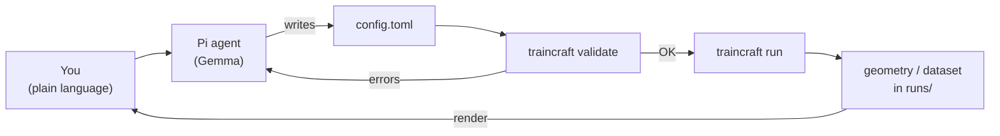

# Tutorial 11 · Driving TrainCraft with the Pi Agent

**What you'll learn:** how to drive TrainCraft in plain language with the
[Pi](https://pi.dev) coding agent running a Gemma model — you describe a system
or workflow ("fill a (10,10) nanotube with a 3:1 water/ethanol blend and run a
short MD"), and Pi writes the TOML, validates it, and launches the run — plus
how to **see the geometries it builds** on a headless VM with no display.

**Prerequisites:** TrainCraft installed (the `science` pixi env if you want
Packmol/RDKit systems) and the [Pi agent](https://pi.dev).

**Time:** ~15 minutes.

!!! note "TrainCraft doesn't ship an agent — Pi does the agentic work"
    TrainCraft ships a clean CLI and a large but regular TOML config surface —
    exactly the kind of thing an LLM is good at filling in. Pi is the agent: it
    reads the schema, writes configs, runs the CLI, and reacts to errors. The
    only TrainCraft-specific piece is a **skill** — a small Markdown file that
    teaches Pi this repo's commands and gotchas. You point Pi at the skill once
    and it configures itself from there.

---

## Why an agent?

The config surface has grown: builders for molecules, surfaces, slabs, crystals,
2D materials and filled nanotubes; mixtures with arbitrary ratios; alloy
compositions; samplers; the selection funnel; calculators; HPC orchestration.
Memorising every key is a chore — but the *rules* are regular, the
[Config Schema](../reference/config.md) is exhaustive, and `traincraft validate`
tells the agent immediately if it got something wrong. So an agent that has read
the skill and a few [`examples/`](https://github.com/basillicus/traincraft/tree/main/examples)
can assemble a correct config from one sentence:



---

## Step 1 · Install Pi

```bash
curl -fsSL https://pi.dev/install.sh | sh
```

(`npm install -g --ignore-scripts @earendil-works/pi-coding-agent` also works.)
Pi is a minimal harness: the model gets a few tools — read, write, edit, and
**bash** — which is all it needs to run `traincraft` and `pixi`.

---

## Step 2 · Point Pi at `gemma4-31b-it`

Pi reads model definitions from `~/.pi/agent/models.json`. `gemma4-31b-it` is a
[Hugging Face](https://huggingface.co) model, so you can point Pi at **any**
OpenAI-compatible endpoint that serves it — you're free to use your own. The two
common starting points:

=== "OpenRouter (no endpoint of your own)"

    The quickest way to start if you don't run a server. At the time of writing
    OpenRouter offers a **free** tier of this model — get a key from
    [openrouter.ai](https://openrouter.ai) and register it:

    ```json title="~/.pi/agent/models.json"
    {
      "providers": {
        "openrouter": {
          "baseUrl": "https://openrouter.ai/api/v1",
          "api": "openai-completions",
          "apiKey": "sk-or-...",                // your OpenRouter key
          "models": [
            { "id": "google/gemma-4-31b-it:free" }   // use the exact slug from openrouter.ai/models
          ]
        }
      }
    }
    ```

    !!! danger "Free models are not private"
        On free/community tiers the provider may log and train on your prompts.
        **Never send confidential, unpublished, or proprietary structures,
        datasets or research through a free model.** For anything sensitive,
        serve the model yourself (next tab) or use a paid, no-logging endpoint.

=== "Your own endpoint (local or hosted)"

    Serve `gemma4-31b-it` with vLLM, llama.cpp, Ollama, … — anything that speaks
    the OpenAI chat/completions API — and give Pi its base URL:

    ```json title="~/.pi/agent/models.json"
    {
      "providers": {
        "gemma": {
          "baseUrl": "http://localhost:8000/v1",   // your gemma4-31b-it endpoint
          "api": "openai-completions",
          "apiKey": "local",                        // any string if the server ignores it
          "models": [
            { "id": "gemma4-31b-it" }
          ]
        }
      }
    }
    ```

    Keeps your data on your own hardware/account — the right choice for private
    work. `vllm serve <repo-id>` or an Ollama instance
    (`"baseUrl": "http://localhost:11434/v1"`) both work; just match `baseUrl`
    and the model `id` to your server.

Then start Pi in the TrainCraft repo and select the model:

```bash
cd /path/to/traincraft
pi
# inside Pi:  /model   → pick your gemma4-31b-it entry   (or cycle with Ctrl+L)
```

---

## Step 3 · Give Pi the TrainCraft skill

The skill is a single Markdown file following Pi's
[Agent Skills](https://pi.dev) standard. It front-loads this repo's commands and
gotchas so Pi configures itself and knows how to operate on your instructions. It
**ships in the repo** at
[`skills/traincraft/SKILL.md`](https://github.com/basillicus/traincraft/blob/main/skills/traincraft/SKILL.md),
so that file is the single source of truth — install it and reload:

```bash
# inside Pi — install the repo's skill (or from npm), then reload:
pi install git:github.com/basillicus/traincraft
/reload
```

…or simply tell Pi in chat: *"read `skills/traincraft/SKILL.md` and set yourself
up."* Pi has read/write/bash tools, so it fetches the file into
`~/.pi/agent/skills/`, reads it, and applies it — no manual wiring.

A trimmed excerpt of what it teaches Pi:

```markdown title="skills/traincraft/SKILL.md (excerpt)"
---
name: traincraft
description: Act as a TrainCraft expert — plain-language requests → validated TOML → run.
---

# Mandatory
- ALWAYS read the docs (docs/reference/config.md + examples/) before writing anything.
- Build EXACTLY what the user asked — no extra stages, molecules or "improvements".
- When information is missing or ambiguous, ASK the user rather than guessing.

# Environment
- core    : `pixi install`              EMT + simple builders.
- science : `pixi install -e science`   Packmol + RDKit + tblite/GFN2-xTB.
- mace    : `pixi install -e mace`       torch + mace-torch.
Always run with `pixi run -e <env> traincraft run <file>`. `liquid`,
`surface_packing`, `filled_nanotube` and any SMILES need `-e science`.

# Workflow
Docs first (grep docs/ + examples/, don't guess keys) → write TOML →
`traincraft validate <file>` → run → review `runs/<name>/`.

# Gotchas
- Prefer `molecule_name` (ASE g2 = formulae: "H2O", "CH4", "CO"=carbon monoxide)
  over `smiles` for small molecules; `smiles="O"` is water, `smiles="CO"` is METHANOL.
- Mixtures: one `species` list per placing builder; use `count` XOR `ratio`.
- Alloys: a `composition` list (element + ratio) on crystal/slab/surface builders.
- filled_nanotube wall clearance is auto-sized (vdW + fixed Packmol obstacle).
- Fragments: framework = tc_fragment -1; each mobile molecule its own id >= 0.
```

(The full file also covers the builder/calculator/sampler names, the real output
paths under `runs/<name>/`, and how to render geometries headlessly.)

---

## Step 4 · A worked session

> **You:** Fill a roomy carbon nanotube with a 3-to-1 mixture of water and
> ethanol, 12 molecules total, and run a short MD at 350 K.

Pi recalls from the skill that `filled_nanotube` + a `species` mixture needs the
`science` env, that ethanol is best given as a SMILES while water is best as a
`molecule_name`, and writes:

```toml
[run]
name = "tube_waterethanol"
seed = 7
outdir = "runs"

[geometry.builder]
type        = "filled_nanotube"
n           = 12          # (12,12) — wide enough for two species
m           = 12
length      = 8
n_molecules = 12          # total; ratios below apportion to integers
tolerance   = 2.0
pbc         = true

[[geometry.builder.species]]
molecule_name = "H2O"
ratio         = 3         # -> 9 waters

[[geometry.builder.species]]
smiles = "CCO"            # ethanol
ratio  = 1               # -> 3 ethanols

[calculator]
type   = "tblite"
method = "GFN2-xTB"

[sampling]
type        = "md"
temperature = 350.0
steps       = 200
interval    = 20
timestep    = 0.5

[selection]
steps  = ["physicality", "dedup", "diversity"]
budget = 8

[dataset]
path = "dataset"
```

It runs `traincraft validate`, sees `OK`, and (after you confirm) launches
`pixi run -e science traincraft run examples/_agent.toml`. The structures land in
`runs/tube_waterethanol/`.

---

## Visualising what the agent built (on a headless VM)

You're on a VM with no display, `ssh -X` is painful, and you'd like to *see* the
geometry. Good news: **3D molecular rendering happens in your browser via WebGL**
— the VM only has to serve data, so no X server is needed at all. Here are three
options, lightest first.

### Option A — Headless PNG (zero install, agent-friendly)

ASE renders straight to a PNG with matplotlib's Agg backend (already in the
`science` env), so Pi itself can produce a picture and hand you the file:

```python title="render.py"
import sys
from ase.io import read, write

atoms = read(sys.argv[1])           # any .xyz / .extxyz / .cif the run produced
write("preview.png", atoms,
      rotation="-75x,0y,0z",        # tilt so you see into the tube
      radii=0.5, show_unit_cell=2)
```

```bash
pixi run -e science python render.py runs/tube_waterethanol/structures/initial.extxyz
```

Then just `scp` `preview.png` to your laptop (or have Pi embed it in its reply).
This is the most robust option — it works over plain SSH with nothing forwarded.
Tell Pi (via the skill) to **call this after every build** so each structure
comes back with a thumbnail.

### Option B — Jupyter Lab + a WebGL widget (interactive, recommended)

For spinning, zooming, and *editing* structures, run a Jupyter server on the VM
and forward its port to your laptop's browser:

```bash
# one-time: add an interactive viewer to an env
pixi add --feature geometry jupyterlab weas-widget   # WEAS: edit atoms in-browser
# (py3Dmol or nglview also work; weas-widget supports interactive editing)

# on the VM:
pixi run -e science jupyter lab --no-browser --ip 127.0.0.1 --port 8888
```

```bash
# on your laptop:
ssh -L 8888:localhost:8888 you@your-vm
# then open the printed http://localhost:8888/?token=... URL locally
```

In a notebook cell:

```python
from weas_widget import WeasWidget
from ase.io import read
WeasWidget(from_ase=read("runs/tube_waterethanol/structures/initial.extxyz"))
```

For MD output, point the reader at the multi-frame `.extxyz` trajectory and the
widget will let you scrub frames.

### Option C — A static py3Dmol page served over a port

If you want a plain shareable web page with no Jupyter:

```python title="to_html.py"
import sys, py3Dmol
xyz = open(sys.argv[1]).read()
v = py3Dmol.view(width=900, height=700)
v.addModel(xyz, "xyz"); v.setStyle({"stick": {}, "sphere": {"scale": 0.3}})
v.zoomTo()
open("view.html", "w").write(v._make_html())
```

```bash
pixi run -e science python to_html.py runs/<name>/structures/initial.extxyz
python -m http.server 8000          # serve the folder
# laptop:  ssh -L 8000:localhost:8000 you@your-vm  →  open http://localhost:8000/view.html
```

!!! info "A purpose-built workbench is on the roadmap"
    A single browser app — Pi's chat alongside tabs for the geometry, a
    node-based workflow editor, and dataset exploration with
    [chemiscope](https://github.com/lab-cosmo/chemiscope) — is on the
    [roadmap](../roadmap.md). Until then, Jupyter (Option B) is the closest
    ready-made surface: chat to Pi in one cell, render/nudge the structure in the
    next, re-run.

---

## Guardrails worth keeping

- **Validate before running.** `traincraft validate` is cheap and catches the
  vast majority of the agent's mistakes before any compute is spent.
- **Right env, every time.** The skill makes Pi prefix runs with
  `pixi run -e science` for anything touching Packmol/RDKit/xTB. A run in the
  `default` env will fail on those imports.
- **Confirm before launching long jobs** (MD, MACE training, Slurm submission).
- **Never install outside an env.** Pixi environments *are* the virtualenvs;
  Pi should add deps with `pixi add`, not a global `pip install`.

---

## Where to go next

- [Config Schema](../reference/config.md) — the reference the skill points Pi at.
- [Geometry System](../concepts/geometry.md) — mixtures, alloys, fragments.
- [Run on HPC](../how-to/hpc.md) — once Pi's configs are good, dispatch them to a
  Slurm cluster.
