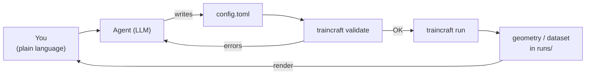

# Tutorial 11 · Driving TrainCraft with an AI Agent

**What you'll learn:** how to point a large-language-model *agent* at TrainCraft
so you can describe what you want in plain language ("fill a (10,10) nanotube
with a 3:1 water/ethanol blend and run a short MD") and have it write the TOML,
validate it, and launch the run — plus how to **see the geometries it builds**
when you're working on a headless VM with no graphical display.

**Prerequisites:** TrainCraft installed (the `science` pixi env if you want
Packmol/RDKit systems), and an [OpenRouter](https://openrouter.ai) account.

**Time:** ~20 minutes.

!!! note "This is bring-your-own-agent"
    TrainCraft does **not** ship an agent. It ships a clean CLI and a large but
    regular TOML config surface — exactly the kind of thing an LLM is good at
    filling in. This tutorial shows the *pattern*: a system prompt (a "skill")
    that teaches the agent the repo's gotchas, plus an LLM behind it. It works
    with any agent runner you like; the only TrainCraft-specific part is the
    skill and the commands the agent is allowed to run.

---

## Why an agent?

The config surface has grown: builders for molecules, surfaces, slabs, crystals,
2D materials and filled nanotubes; mixtures with arbitrary ratios; alloy
compositions; samplers; the selection funnel; calculators; HPC orchestration.
Memorising every key is a chore. But the *rules* are regular and the
[Config Schema](../reference/config.md) is exhaustive, so an LLM that has read
the schema and a handful of [`examples/`](https://github.com/basillicus/traincraft/tree/main/examples)
can assemble a correct config from one sentence — and `traincraft validate`
tells it immediately if it got something wrong.

The loop is simply:



---

## Step 1 · An OpenRouter key and a model

[OpenRouter](https://openrouter.ai) is an OpenAI-compatible gateway to many
models, so you can start cheaply with an open model and swap later without
changing code. A mid-size open model (e.g. a Gemma — use the exact slug shown on
[openrouter.ai/models](https://openrouter.ai/models), such as
`google/gemma-3-27b-it`) is plenty for writing TrainCraft configs; reach for a
larger model only if you ask it to reason about the *science*.

```bash
export OPENROUTER_API_KEY="sk-or-..."
```

Because the endpoint is OpenAI-compatible, most agent runners pick it up via the
standard OpenAI env vars:

```bash
export OPENAI_API_KEY="$OPENROUTER_API_KEY"
export OPENAI_BASE_URL="https://openrouter.ai/api/v1"
```

!!! warning "Keep the key out of git"
    Put these in your shell profile or a `.env` file that is **gitignored** —
    never in a committed config.

---

## Step 2 · The skill (system prompt)

This is the only TrainCraft-specific piece. Give it to your agent as the system
prompt / skill. It front-loads the gotchas so the agent doesn't have to
rediscover them every session:

```markdown title="traincraft-skill.md"
You are an assistant that drives TrainCraft, a tool for generating MLIP training
datasets. The user describes a system or workflow in plain language; you produce
a TrainCraft TOML config, validate it, and (on confirmation) run it.

# How to work
1. Read `docs/reference/config.md` for the full schema and `examples/*.toml` for
   patterns. When unsure of a key, grep the examples rather than guessing.
2. Write the config to `examples/` or a working dir. Then ALWAYS run
   `traincraft validate <file>` and fix any error before running.
3. Only run with `pixi run -e <env> traincraft run <file>` so dependencies
   resolve. NEVER pip-install into the base system — pixi envs are the venvs.
4. After a run, point the user at the output in `runs/<name>/` and offer to
   render the geometry (see "Visualising", below).

# Pixi environments (which one to run in)
- `default` : EMT, simple builders (nanotube, crystal, slab, 2D). No heavy deps.
- `science` : Packmol + RDKit + tblite/GFN2-xTB. REQUIRED for `liquid`,
  `surface_packing`, `filled_nanotube`, SMILES molecules, and C/H/O/N chemistry.
- `mace`    : torch + mace-torch, for MACE-MP0 sampling and training.

# Gotchas (learned the hard way)
- Small/symmetric molecules embed badly from SMILES. Prefer `molecule_name`
  (ASE g2 names: "H2O", "CO" = carbon monoxide, "CH4", "C6H6") over `smiles`
  for those. `smiles = "O"` is water, `smiles = "CO"` is METHANOL.
- Mixtures: every placing builder shares one `species` list. Use `count` (exact)
  OR `ratio` (apportioned to integers — then set the builder's `n_molecules`
  total). Never mix count and ratio in one list.
- Alloys: add a `composition` list (element + ratio in (0,1]) to crystal / slab /
  surface builders to make a random solid solution.
- filled_nanotube: wall clearance is sized from van der Waals radii and the tube
  is fed to Packmol as a fixed obstacle, so guests never overlap the wall. Widen
  the tube ((n,m)) if it refuses to fill; `tolerance` is the main spacing dial.
- Fragments: framework atoms (tube/slab/substrate) are tagged tc_fragment = -1;
  each mobile molecule gets its own id >= 0.
- Anything needing Packmol/RDKit but run in `default` will fail — use `science`.

# Useful commands
- `traincraft plugins`              list registered builders/samplers/etc.
- `traincraft new <path>`           write a starter config
- `traincraft validate <file>`      check a config and show the resolved stages
- `pixi run -e <env> traincraft run <file>`   run the pipeline
```

The exact mechanism for loading this depends on your agent runner — it's the
file your runner reads as the system prompt / skill before the conversation
starts. (You mentioned you're wiring one up; this is the content to put in it.)

---

## Step 3 · A minimal agent loop (if you're rolling your own)

If you don't already have a runner, here is the whole thing in ~30 lines with the
`openai` SDK pointed at OpenRouter. It asks the model for a config, writes it,
validates it, and feeds any error back — no special tool-calling support
required, so it works even with smaller open models:

```python title="agent.py"
import os, re, subprocess, pathlib
from openai import OpenAI

client = OpenAI(
    api_key=os.environ["OPENROUTER_API_KEY"],
    base_url="https://openrouter.ai/api/v1",
)
MODEL = "google/gemma-3-27b-it"  # use the exact slug from openrouter.ai/models
SKILL = pathlib.Path("traincraft-skill.md").read_text()

def ask(messages):
    r = client.chat.completions.create(model=MODEL, messages=messages)
    return r.choices[0].message.content

def extract_toml(text):
    m = re.search(r"```(?:toml)?\n(.*?)```", text, re.S)
    return m.group(1) if m else None

msgs = [{"role": "system", "content": SKILL}]
msgs.append({"role": "user", "content": input("What do you want to build? ")})

for _ in range(4):                       # a few self-correction rounds
    reply = ask(msgs); print(reply)
    toml = extract_toml(reply)
    if not toml:
        break
    path = pathlib.Path("examples/_agent.toml"); path.write_text(toml)
    chk = subprocess.run(["traincraft", "validate", str(path)],
                         capture_output=True, text=True)
    if chk.returncode == 0:
        print("✅ valid. Run with:  pixi run -e science traincraft run", path)
        break
    msgs += [{"role": "assistant", "content": reply},
             {"role": "user", "content": f"validate failed:\n{chk.stderr or chk.stdout}\nFix it."}]
```

```bash
pixi run -e science python agent.py
```

A real runner adds: letting the agent *read* files (so it can grep the schema),
asking before it runs anything, and streaming output. But the spine is exactly
the loop above — and `traincraft validate` is what keeps the model honest.

---

## Step 4 · A worked session

> **You:** Fill a roomy carbon nanotube with a 3-to-1 mixture of water and
> ethanol, 12 molecules total, and run a short MD at 350 K.

The agent recalls that `filled_nanotube` + a `species` mixture needs the
`science` env, that ethanol is best given as a SMILES while water is best as a
`molecule_name`, and writes:

```toml
[run]
name = "tube_waterethanol"
seed = 7
outdir = "runs"

[geometry.builder]
type        = "filled_nanotube"
n           = 12          # (12,12) — wide enough for two species
m           = 12
length      = 8
n_molecules = 12          # total; ratios below apportion to integers
tolerance   = 2.0
pbc         = true

[[geometry.builder.species]]
molecule_name = "H2O"
ratio         = 3         # -> 9 waters

[[geometry.builder.species]]
smiles = "CCO"            # ethanol
ratio  = 1               # -> 3 ethanols

[calculator]
type   = "tblite"
method = "GFN2-xTB"

[sampling]
type        = "md"
temperature = 350.0
steps       = 200
interval    = 20
timestep    = 0.5

[selection]
steps  = ["physicality", "dedup", "diversity"]
budget = 8

[dataset]
path = "dataset"
```

It runs `traincraft validate`, sees `OK`, and (after you confirm) launches
`pixi run -e science traincraft run examples/_agent.toml`. The structures land in
`runs/tube_waterethanol/`.

---

## Visualising what the agent built (on a headless VM)

You're on a VM with no display, `ssh -X` is painful, and you'd like to *see* the
geometry. Good news: **3D molecular rendering happens in your browser via WebGL**
— the VM only has to serve data, so no X server is needed at all. Here are three
options, lightest first.

### Option A — Headless PNG (zero install, agent-friendly)

ASE renders straight to a PNG with matplotlib's Agg backend (already in the
`science` env), so the agent itself can produce a picture and hand you the file:

```python title="render.py"
import sys
from ase.io import read, write

atoms = read(sys.argv[1])           # any .xyz / .extxyz / .cif the run produced
write("preview.png", atoms,
      rotation="-75x,0y,0z",        # tilt so you see into the tube
      radii=0.5, show_unit_cell=2)
```

```bash
pixi run -e science python render.py runs/tube_waterethanol/geometry/structure.xyz
```

Then just `scp` `preview.png` to your laptop (or have the agent embed it in its
reply). This is the most robust option — it works over plain SSH with nothing
forwarded. Have your **agent call this after every build** so each structure
comes back with a thumbnail.

### Option B — Jupyter Lab + a WebGL widget (interactive, recommended)

For spinning, zooming, and *editing* structures, run a Jupyter server on the VM
and forward its port to your laptop's browser:

```bash
# one-time: add an interactive viewer to an env
pixi add --feature geometry jupyterlab weas-widget   # WEAS: edit atoms in-browser
# (py3Dmol or nglview also work; weas-widget supports interactive editing)

# on the VM:
pixi run -e science jupyter lab --no-browser --ip 127.0.0.1 --port 8888
```

```bash
# on your laptop:
ssh -L 8888:localhost:8888 you@your-vm
# then open the printed http://localhost:8888/?token=... URL locally
```

In a notebook cell:

```python
from weas_widget import WeasWidget
from ase.io import read
WeasWidget(from_ase=read("runs/tube_waterethanol/geometry/structure.xyz"))
```

Because the notebook and the agent run on the same VM, this doubles as your
**shared surface**: converse with the agent in one cell, render/nudge the
structure it just wrote in the next, and re-run. For MD output, point the reader
at the multi-frame `.extxyz` trajectory and the widget will let you scrub frames.

### Option C — A static py3Dmol page served over a port

If you want a plain shareable web page with no Jupyter:

```python title="to_html.py"
import sys, py3Dmol
xyz = open(sys.argv[1]).read()
v = py3Dmol.view(width=900, height=700)
v.addModel(xyz, "xyz"); v.setStyle({"stick": {}, "sphere": {"scale": 0.3}})
v.zoomTo()
open("view.html", "w").write(v._make_html())
```

```bash
pixi run -e science python to_html.py runs/.../structure.xyz
python -m http.server 8000          # serve the folder
# laptop:  ssh -L 8000:localhost:8000 you@your-vm  →  open http://localhost:8000/view.html
```

### What about "chat *and* edit the geometry in one browser app"?

That single integrated app — chat on one side, a live 3D editor on the other,
both wired to the agent — is **not** something TrainCraft ships, and there's no
turnkey tool that does exactly this for arbitrary agents today. The honest,
working path is Jupyter (Option B): it gives you chat + WebGL editing + the
ability to re-run TrainCraft in one port-forwarded browser tab. If you want a
purpose-built page, the small-but-real DIY route is a
[Streamlit](https://streamlit.io)/[Gradio](https://www.gradio.app) app combining
a chat box with [`stmol`](https://github.com/napoles-uach/stmol) (py3Dmol in
Streamlit) for the viewer — a few dozen lines, but you own it. Treat that as a
future project rather than a built-in.

---

## Guardrails worth keeping

- **Validate before running.** `traincraft validate` is cheap and catches the
  vast majority of the agent's mistakes before any compute is spent.
- **Right env, every time.** Make the agent prefix runs with
  `pixi run -e science` for anything touching Packmol/RDKit/xTB. A run in the
  `default` env will fail on those imports.
- **Confirm before launching long jobs** (MD, MACE training, Slurm submission).
- **Never install outside an env.** Pixi environments *are* the virtualenvs;
  the agent should add deps with `pixi add`, not a global `pip install`.

---

## Where to go next

- [Config Schema](../reference/config.md) — the reference the agent should read.
- [Geometry System](../concepts/geometry.md) — mixtures, alloys, fragments.
- [Run on HPC](../how-to/hpc.md) — once the agent's configs are good, dispatch
  them to a Slurm cluster.
