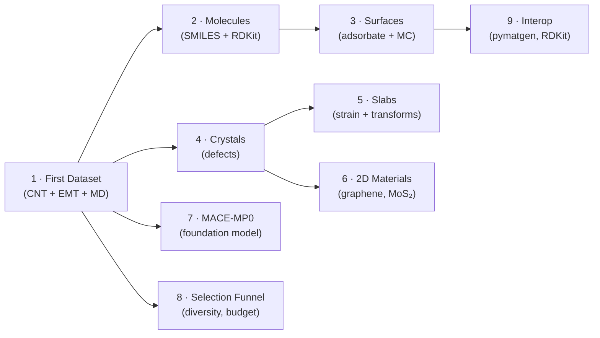

# Tutorials

The tutorials are step-by-step guides that assume you are new to TrainCraft.
Each one introduces a specific system type or capability and builds on the
previous ones.

You don't have to read them in order — jump to whichever system type is most
relevant to your work.

---

## Learning path

---

## Quick reference

| Tutorial | System type | Extra deps | Pixi env |
|---|---|---|---|
| [1 · First Dataset](01-first-dataset.md) | Carbon nanotube | None | `default` |
| [2 · Molecules](02-molecules.md) | Small molecules, SMILES | RDKit | `science` |
| [3 · Surfaces](03-surfaces.md) | Adsorbate + MC sampler | (RDKit optional) | `default` / `science` |
| [4 · Crystals](04-crystals-defects.md) | Bulk + defects | None | `default` |
| [5 · Slabs & Strain](05-slabs-strain.md) | Slab + transforms | None | `default` |
| [6 · 2D Materials](06-2d-materials.md) | Graphene, hBN, MoS₂ | None | `default` |
| [7 · MACE-MP0](07-mace-mp0.md) | Any periodic system | torch, mace-torch | `mace` |
| [8 · Selection Funnel](08-selection-funnel.md) | Any | None | `default` |
| [9 · Interop](09-interop.md) | Any | pymatgen, RDKit | `science` |
